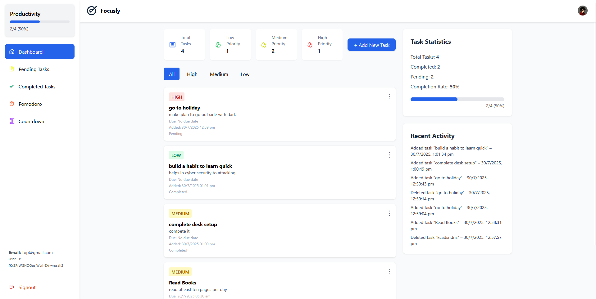

# 🌟 Focusly – Smart Task Manager

> A modern task management web app to help you organize life, boost productivity, and stay focused.  
> Built with **Flask**, **Firebase**, **Google OAuth**, and **TailwindCSS**.




---

## ✨ Features

- 🔑 **Authentication**
  - Sign in with **Google OAuth 2.0**
  - Sign in with **Phone Authentication** via Firebase
  - Secure session management with Flask
- 📊 **User Data Management**
  - Store user profiles in Firebase Firestore
  - Track last login and user activity
- ⏳ **Pomodoro Timer**
  - Pomodoro, Short Break, and Long Break modes
  - Responsive timer with reset functionality
- 🌍 **Smart Geo Detection**
  - Auto-detect user country for phone login
- 🎨 **Beautiful UI**
  - Fully responsive landing page
  - Smooth animations & TailwindCSS design
- 🔒 **Security Features**
  - No-cache headers for sensitive pages
  - Firebase custom tokens for client authentication

---

## 🛠 Tech Stack

- **Backend:** [Flask](https://flask.palletsprojects.com/) (Python)
- **Frontend:** [TailwindCSS](https://tailwindcss.com/) + Jinja Templates
- **Authentication:** [Google OAuth 2.0](https://developers.google.com/identity/protocols/oauth2) + [Firebase Auth](https://firebase.google.com/docs/auth)
- **Database:** [Firebase Firestore](https://firebase.google.com/docs/firestore)
- **Deployment:** Compatible with Heroku / Render / AWS / GCP
- **Environment Management:** Python-dotenv

---
##Live link- https://betsito.com/
## 🚀 Getting Started

Follow these steps to run Focusly locally.

### 1️⃣ Clone the repository
```bash
git clone https://github.com/shivansshhhh/focusly.git
cd focusly
```
### 2️⃣ Create a virtual environment
```bash
python -m venv venv
venv\Scripts\activate   # Windows
source venv/bin/activate # Mac/Linux
```
### 3️⃣ Install dependencies
```bash
pip install -r requirements.txt
```
### 4️⃣ Setup Firebase & Google OAuth Credentials
🔹 Firebase

    Create a Firebase project.

    Enable Authentication → Google & Phone Sign-in.

    Download your Admin SDK JSON and save it as:

    focusly-firebase-adminsdk.json

🔹 Google Cloud

    Create a project in Google Cloud Console.

    Go to APIs & Services → Credentials → Create OAuth Client ID.

    Set Authorized Redirect URI to:

    http://127.0.0.1:5000/auth/callback

### 5️⃣ Add a .env file

FLASK_SECRET_KEY=supersecretkey
GOOGLE_CLIENT_ID=your-google-client-id.apps.googleusercontent.com
GOOGLE_CLIENT_SECRET=your-google-client-secret

### 6️⃣ Run the app
```bash
cd backend
python app.py
```
Visit 👉 http://127.0.0.1:5000

🔑 Environment Variables
Variable	Description
FLASK_SECRET_KEY	Secret key for Flask sessions
GOOGLE_CLIENT_ID	Google OAuth 2.0 Client ID
GOOGLE_CLIENT_SECRET	Google OAuth 2.0 Client Secret
📂 Project Structure
```
focusly/
│── backend/
│   ├── app.py                # Main Flask app
│   ├── focusly-firebase-adminsdk.json
│   ├── templates/            # Jinja2 templates (HTML)
│   │    ├── index.html
│   │    ├── login.html
│   │    ├── register.html
│   │    ├── dashboard.html
│   │    └── pomodoro.html and other's
│   └── static/               # videos, and Images
│
├── requirements.txt
├── .env
└── README.md
```

👨‍💻 Author

Shivansh Panwar
📧 shivanshpawar7448@gmail.com
🌐 https://www.linkedin.com/in/shivansh-d-p/


    ⚡ “Focusly doesn’t just manage your tasks — it manages your time, your goals, and your life.”


---
